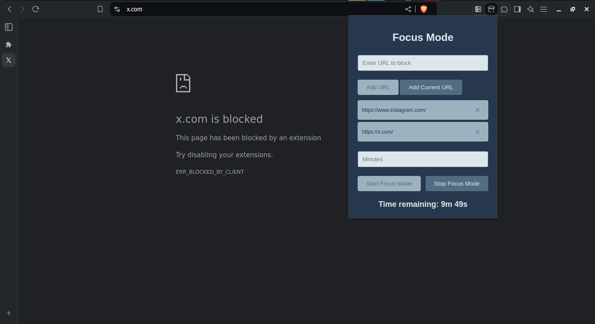

# Project Name: focusMode



## Description:
focusMode is a simple command-line tool that helps you stay focused and minimize distractions while programming. It allows you to block certain websites or applications for a specified period of time, allowing you to concentrate on your work without interruptions.

## Installation:
To install focusMode, follow these steps:

1. Clone the repository:
```
git clone https://github.com/MGuruNikhil/focusMode.git
```

## Usage:
1. To use focusMode, you need to install the focusMode browser extension. Follow these steps:

- Open your Chrome or Chrome-based browser.

- Go to the extensions settings by typing `chrome://extensions` in the address bar and pressing Enter.

- Enable developer mode by toggling the switch in the top right corner of the extensions page.

- Click on "Load unpacked" and navigate to the folder where you have downloaded the focusMode extension.

- Select the extension folder and click "Open" to load the focusMode extension.

- You're done! The focusMode extension is now installed and ready to use.


3. You will be prompted to enter the websites or applications you want to block, as well as the duration of the focus session.

4. Once the focus session starts, the specified websites or applications will be blocked, allowing you to work without distractions.

5. After the specified duration, the blocked websites or applications will be unblocked automatically.
